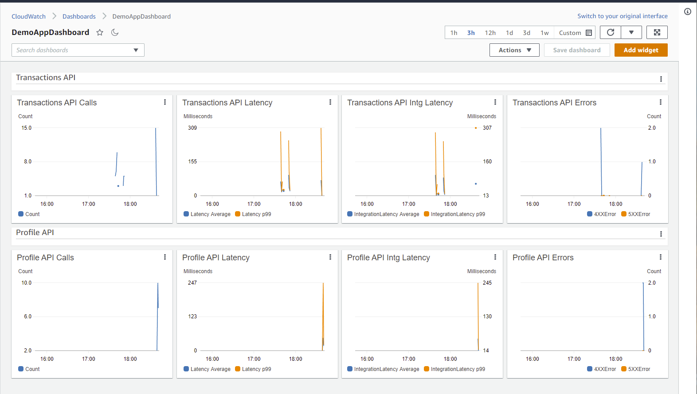

# CloudWatch Dashboard for API Gateway using CDK

This project is an example of building a CloudWatch Dashboard for API Gateway to visualize the API Calls, Latency, Integration Latency, and Errors. The CDK Stack provided uses the CloudWatch Metric and GraphWidget classes to visualize the graphs. The project also includes sample Lambda functions with API Gateway integrations to showcase the dashboards. The stack adds one row for each API to the Dashboard to get a single view for selected metrics and alarms to help you assess the health of your API Gateway integrations. The selected metrics are: Count of API Calls, Latency, Integration Latency, and API Execution Errors.

## Getting started

To get started, clone this [cdk-api-dashboard](https://github.com/aws-samples/aws-cdk-apigateway-cloudwatch-dashboard). The repository contains a [CDK App](bin/api-dashboard.ts) in TypeScript that deploys a [CDK Stack](lib/api-dashboard-stack.ts).

To see or the edit the CloudWatch dashboard, please refer [CDK App](bin/api-dashboard.ts).

### CDK Concepts

This topic describes some of the concepts \(the why and how\) behind the AWS CDK\.

AWS CDK apps are composed of building blocks known as [Constructs](https://docs.aws.amazon.com/cdk/latest/guide/constructs.html), which are composed together to form [stacks](https://docs.aws.amazon.com/cdk/api/latest/docs/@aws-cdk_core.Stack.html) and [apps](https://docs.aws.amazon.com/cdk/api/latest/docs/@aws-cdk_core.App.html)\.

Please visit [here](https://docs.aws.amazon.com/cdk/latest/guide/core_concepts.html) for further reference.

### Prerequisites

To run the sample, you will need:

1. An AWS Account into which you will deploy services. Be sure that you have permissions to deploy resources in the AWS Account
2. CDK Setup is completed by following [this guide](https://docs.aws.amazon.com/cdk/latest/guide/getting_started.html#getting_started_prerequisites)
3. Node setup is completed by following [this guide](https://docs.npmjs.com/downloading-and-installing-node-js-and-npm)
4. Configure your AWS profile using the [quickstart guide](https://docs.aws.amazon.com/cli/latest/userguide/cli-configure-quickstart.html)

### Deployment

To deploy the sample, perform the following:

1. Clone the [cdk-api-dashboard](https://github.com/aws-samples/aws-cdk-apigateway-cloudwatch-dashboard) to your local environment
2. Run `npm install` to install the necessary node modules needed for the project
3. Run `npm run build` to compile the project
4. Run `cdk synth` to see the CloudFormation template
5. Run `cdk deploy` to deploy the Stack
6. Upon successful deployment, you can go into CloudWatch to see the Dashboard (see/edit the [api-dashboard.ts](bin/api-dashboard.ts) for Dashboard name). A sample snapshot is listed here.

### Clean up your Stack

You can delete the stack by running `cdk destroy`.

## Useful commands

 * `npm run build`   compile typescript to js
 * `npm run watch`   watch for changes and compile
 * `npm run test`    perform the jest unit tests
 * `cdk deploy`      deploy this stack to your default AWS Account/region
 * `cdk diff`        compare deployed stack with current state
 * `cdk synth`       emits the synthesized CloudFormation template
 * `cdk destroy`     delete this stack from your default AWS Account/region

## Reference Documentation
For further reference, please consider the following sections:

* [Configuring the AWS CLI](https://docs.aws.amazon.com/cli/latest/userguide/cli-chap-configure.html)
* [What is the AWS CDK?](https://docs.aws.amazon.com/cdk/latest/guide/home.html)
* [Using Amazon CloudWatch dashboards](https://docs.aws.amazon.com/AmazonCloudWatch/latest/monitoring/CloudWatch_Dashboards.html)

## Security

See [CONTRIBUTING](CONTRIBUTING.md#security-issue-notifications) for more information.

## License

This library is licensed under the MIT-0 License. See the [LICENSE](LICENSE) file.